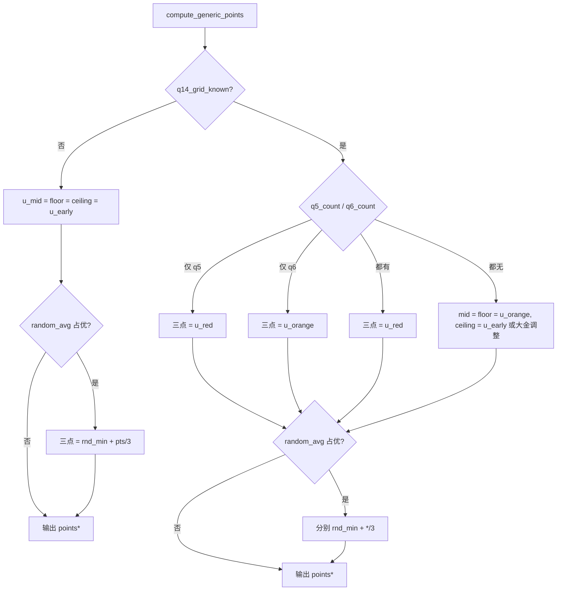

# 画板快照定价公式说明

本文档描述 `build_snapshot_pricing_dict`（`bidking.analysis.strategy.pipeline`）当前实现的通用画板定价逻辑。代码入口见 `_board_pricing.build_snapshot_pricing_dict`。

**流水线**：`prepare_snapshot_pricing_context` → `compute_base_metrics` → `compute_generic_points` → `generic.finalize_pricing_dict` →（可选）`ahmad.enrich_ahmad_pricing`。

爱莎及绝大多数地图走 **通用主价**；仅 **己方 Ahmad（`hero_cid=204`）+ 快递站图（档键 `210`）** 时 `points` / `points_floor` / `points_ceiling` 被 `ahmad_points` 覆盖。

---

## 一、公共基底（所有分支共用）

### 1. 物品总价 `total`

```text
total = Σ merged_items 的 CSV 标价（compute_items_total）
```

- **数据源**：`merged_items_dict_from_snapshot`（`game_state.items` + `grid_overlay.phantom_items` + `manual_shapes` / `infer_shapes` + `phantom_quality_pref` / `unknown_cell_quality_pref` + 手动确认投影）。
- **计入**：手画/自动幽灵（`phantom_vac_*`）、推断外形、多候选权重价（品质未知但有轮廓）等。
- **已移除 kcw**：不再从 `total` 扣除 `known_contour_weighted_price`；`pricing.known_contour_weighted_*` 恒为 0。

### 2. 几何空置 `vacant`

```text
vacant = grid_overlay.vacant.geometric   // 优先使用快照已写字段
```

否则由 `snapshot_occupied_cells` / `vacant_dict_from_board_snapshot` 计算。UI 完整快照下，幽灵矩形（`phantom_items` + `manual_shapes`）会进入 `occupied`，从而从 `vacant` 中排除。

`pricing.vacant` 为原始几何空置，**不在此字段上**扣减 `tier_extra_cells`。

### 3. 档位最少格补价 `tier_extra`（`event_stats` 含 `q*_grid_min` 时）

对每个档 `q ∈ {4, 5, 6}`：

```text
need_q     = max(0, q*_grid_min − confirmed_q*)
             // confirmed_q* = 合并表上该档、有 shape 的几何占位格数之和

uc_q       = unknown_contour 该档超额格数
             // 无 shape、品质已知：Σ max(0, 加权等效格数 − 1)

eff_need_q = max(0, need_q − uc_q)

tier_extra_value += eff_need_q × CSV格均价[q*]    // 键 q4 / q5 / q6
tier_extra_cells += round(Σ eff_need_q)          // 各档 eff_need 累加后取整
```

- 无 `shape`、品质已知的物品：期望价在 **total** 中；超额格从 **tier_extra** 抵扣，**不再**从 `vacant_adj` 单独扣减。
- **品质未知幽灵**（`phantom_items` 且合并后 `quality is None`、有 `shape`）：`total` 仍用 `_item_value`；`confirmed_q5/q6` 另加 `phantom_unknown_tier_credit` — 在 `C_gr={5,6}\excluded_qualities` 上对 footprint **均匀分摊**（见 `strategy.common.phantom_unknown_tier_credit_q456`）。

### 4. 有效空置与点数基底

```text
vacant_adj      = max(0, vacant − tier_extra_cells)
vacant_pts_base = total + tier_extra_value
```

**已移除**：`vacant_adj` 中的 `+ kcw_geo`、`vacant_pts_base` 中的 `− kcw_val`。

### 5. 参考估价（非主价，供 UI / 对照）

```text
est_orange   = vacant_pts_base + vacant_adj × u_orange
est_gold_red = vacant_pts_base + vacant_adj × u_gr
est_red      = vacant_pts_base + vacant_adj × u_red
```

| 符号 | CSV 键 |
|------|--------|
| `u_orange` | `q5` |
| `u_gr` | `q5+q6` |
| `u_red` | `q6` |

---

## 二、早单价 `u_early`

1. **默认**：`vacant_early_unit_from_exclusions` — 由 `scan_history` 得可能品质集 → CSV 组合键（如 `q4+q5+q6`、`all`）。
2. **仅当** `event_stats.q4_grid_count` 已知 **且** 扫描可能集仍含 q4：去掉 q4，改查剩余集合对应键（如 `q5+q6`）。
3. **已删除**：仅 `q4_grid_min`（无 `q4_grid_count`）时的 `q4+q5+q6` 与 `q5+q6` 算术平均。

写入 `pricing.early_vacant_unit_from_scan`、`early_vacant_csv_group`、`early_vacant_possible_qualities`。

---

## 三、主价 `points` / `points_floor` / `points_ceiling`

统一形式：

```text
points* = vacant_pts_base + vacant_adj × u*
```

最终输出为 `int(round(...))`。

### 条件 A：`q14_grid_known = false`

**判定**：`event_stats_q12_q3_q4_grids_all_known(raw)` 为 false。  
需 `q3_grid_count`、`q4_grid_count`，且 `q12_grid_count` 或 (`q1_grid_count` + `q2_grid_count`) 已知。

| 字段 | 单价 |
|------|------|
| `points` = `points_floor` = `points_ceiling` | `u_early` |

**`random_avg_price_min` 混合**（占优时三点相同）：

```text
若 random_avg_price_min > 0.5 × points：
  points = floor = ceiling = random_avg_price_min + points / 3
```

### 条件 B：`q14_grid_known = true`

按 `q5_grid_count` / `q6_grid_count` 分支（`raw_pricing` 可用 `total_grid_count` 守恒**推断**缺失档，见 `raw_pricing._infer_q56_grid_from_total_and_q14`）：

| 子条件 | `points`（中） | `points_floor` | `points_ceiling` |
|--------|----------------|----------------|------------------|
| 仅 `q5_grid_count` | `u_red` | `u_red` | `u_red` |
| 仅 `q6_grid_count` | `u_orange` | `u_orange` | `u_orange` |
| 二者皆有 | `u_red` | `u_red` | `u_red` |
| 二者皆无 | `u_orange` | `u_orange` | `u_early`（或大金区调整） |

**大金区**（仅「二者皆无」且 `infer_big_gold_adjustment_enabled()`）：

- 识别空置连通区中的大金矩形；
- `points_ceiling` 用 `adjust_u_early_for_big_gold(u_early, u_orange, big_gold_cells, total_vacant)`，否则 `u_early`。

**`random_avg_price_min` 混合**（低档已齐，不压平区间）：

```text
points   = random_avg_price_min + points / 3
floor    = random_avg_price_min + points_floor / 3
ceiling  = random_avg_price_min + points_ceiling / 3
```

---

## 四、决策流（主价单价）



---

## 五、Ahmad 覆盖

**激活**：`is_ahmad_pricing_active` — `hero_cid == 204` 且 `map_bundle_is_express_station_series(map_id)`（档键 `210`）。

```text
points = points_floor = points_ceiling = ahmad_points
generic_points / generic_points_floor / generic_points_ceiling = 通用公式结果（对照）
```

`ahmad_points` = 候选 A/B/C/D/E 的 **最大值**（见 `strategy/ahmad.py`）。候选 E：

```text
pts_e = vacant_pts_base + vacant_adj × (q1+q2+q3 格均价 × ahmad_abde_scale)
```

（需 `board_items_total != 0`。）

---

## 六、爱莎 Bot 层（画板价之后）

画板 `pricing` 产出后，`pricing/strategies/aisha_base` 以 `pricing.points` 为锚，第 3–5 回合可在 `points_floor` 与 `points_ceiling` 之间做「空置红择优」（`vacant_red_floor_ceiling_pick`）。**不改变** `vacant_pts_base` / `vacant_adj` 的计算。

`compute_price` 在基础估价与回合处理之后还会根据对手历史出价做修正，详见 [基于对手价调整](./opponent_bid_adjustment.md)。

---

## 七、`pricing` 字段速查

| 字段 | 含义 |
|------|------|
| `total` | 合并物品标价和 |
| `vacant` | 几何空置（原值） |
| `vacant_source` | 空置计数来源 |
| `tier_extra_value` / `tier_extra_cells` | grid_min 补价 / 从 vacant_adj 扣除的格数 |
| `vacant_pts_base` | `total + tier_extra_value` |
| `vacant_adj` | `max(0, vacant − tier_extra_cells)` |
| `points` / `points_floor` / `points_ceiling` | 主价三点 |
| `est_orange` / `est_gold_red` / `est_red` | 金 / 金红 / 红单价下的参考总价 |
| `early_vacant_unit_from_scan` | `u_early` |
| `early_points_blended_with_random_avg` | 是否经过 random_avg 混合 |
| `known_contour_weighted_price` / `known_contour_weighted_cells` | 恒 0（已不再参与计算） |
| `unknown_contour_vacant_weighted_excess` | 无 shape 物品的超额明细（含 `excess_by_quality`） |
| `phantom_unknown_quality` | 品质未知幽灵（`quality is None`）的 tier 占位分摊明细（`tier_credit_q5/q6`） |
| `ahmad_points` / `ahmad_pricing_active` / `generic_points*` | Ahmad 专用 |

---

## 八、典型场景

| 场景 | `vacant_pts_base` | `vacant_adj` | 主价单价 |
|------|-------------------|--------------|----------|
| 早期（q14 未齐） | `total + tier_extra` | `vacant − tier_extra_cells` | 三点均为 `u_early` |
| q14 齐、金红 count 皆无 | 同上 | 同上 | 中/下=`u_orange`，上=`u_early`（可大金调整） |
| q14 齐、仅知 q5 count | 同上 | 同上 | 三点=`u_red` |
| q14 齐、仅知 q6 count | 同上 | 同上 | 三点=`u_orange` |
| 金红已知 + grid_min 已知 | tier 吸收最少格；幽灵价在 total | 幽灵格通常在 occupied 中已排除 | 见上表 q5/q6 分支 |

---

## 九、相关源码

| 模块 | 职责 |
|------|------|
| `analysis/strategy/pipeline.py` | 基底指标 + 通用主价 |
| `analysis/strategy/common.py` | tier_extra、早单价、random_avg、大金区 |
| `analysis/unknown_value.py` | 无轮廓物品的加权超额（按品质） |
| `analysis/_board_pricing.py` | `compute_items_total`、模块说明 |
| `analysis/grid_overlay_vacant_zone.py` | `vacant` / `occupied` |
| `analysis/grid_overlay_item_merge.py` | `merged_items_dict` |
| `analysis/strategy/ahmad.py` | Ahmad 多候选主价 |
| `pricing/strategies/aisha_base.py` | 爱莎出价锚定与 floor/ceiling 择优 |
| `pricing/opponent_adjust.py` | 对手价调整入口与隐秘图分支 |
| `pricing/strategies/aisha_opponent.py` | 艾莎对手价决策 |
| `pricing/strategies/ahmad_opponent.py` | Ahmad 对手价决策 |

---

*文档随代码更新；以 `tests/analysis/test_board_pricing.py` 为行为回归依据。*
